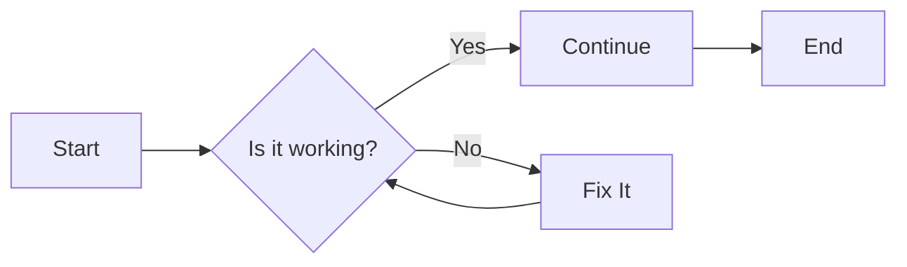

# How it works
The script is designed to systematically scan all markdown files located at the root of your project or repository. It identifies the corresponding configurations for each markdown file and reads them. Subsequently, the script prepares the files, applies the configurations, and generates the final output in PDF format. This process is executed using Python, leveraging Pandoc to facilitate the conversion of markdown to PDF via \LaTeX.

## Configuration
The output can be configured using a configuration file. There are three levels of configuration: the markdown-specific configuration file, the general configuration file, and the default configuration that is applied if no configuration files are found in the root folder.

### Markdown specific configuration file
The markdown-specific configuration file is created by appending ".cfg" to the markdown file name. For instance, if you have a file named "Installation_guide.md," the corresponding configuration file would be "Installation_guide.md.cfg" (case-sensitive). This file contains the same data as the general configuration file, but if both files exist, the markdown-specific configuration file takes precedence.

### General configuration file
The general configuration file is applied universally to all outputs unless a markdown-specific configuration file is present. This configuration file should be named "d2ds.cfg."

### Default configuration file
The default configuration file is utilized when neither a general configuration file nor a markdown-specific configuration file is found. While this file provides a fallback option, it is recommended to use a configuration file to avoid reliance on the default settings.

# New markdown syntax

## Diagrams
A nice feature of D2DS is the possibility to embed textually-specified diagrams with the help of [Mermaid](https://mermaid.js.org/) and [PlantUML](https://plantuml.com/). They are both powerful options and they are used in the same manner. 

You create a code block, chose the engine and then "describe" your diagram. When the PDF is being created, the correct engine will then parse the input and replace it with a generated diagram.

A notable feature of D2DS is the ability to embed textually-specified diagrams using [Mermaid](https://mermaid.js.org/) and [PlantUML](https://plantuml.com/). Both options are robust and are utilized in a similar manner.

To create a diagram, you simply generate a code block, select the desired engine, and then "describe" your diagram. During the PDF creation process, the appropriate engine will parse the input and replace it with the generated diagram.

### Mermaid
Mermaid [offers](https://mermaid.js.org/intro/) a wide variety of diagrams that can be created, with everything from flowcharts and sequence diagrams to timelines and mind-maps.
To use Mermaid, you create a codeblock and chose "mermaid" as the language (for syntax, check their [website](https://mermaid.js.org/intro/syntax-reference.html)):

~~~markdown

~~~~

The code above generates following diagram:


You can also use inline metadata to alter your output further. Read more about what metadata can be used [here](https://github.com/raghur/mermaid-filter?tab=readme-ov-file#attributes). Keep in mind that IDs/references does not currently work on mermaid figures.
Here is an example of a mermaid codeblock with some metadata:

~~~markdown
```{.mermaid width=400}
---
config:
    theme: neutral
---
graph LR
    A[Start] --> B{Is it working?}
    B -- Yes --> C[Continue]
    B -- No --> D[Fix It]
    D --> B
    C --> E[End]
```
~~~

```{.mermaid width=400}
---
config:
    theme: neutral
---
graph LR
    A[Start] --> B{Is it working?}
    B -- Yes --> C[Continue]
    B -- No --> D[Fix It]
    D --> B
    C --> E[End]
```
To know how your Mermaid code will end up looking like without having to run D2DS, you can use this [website](https://mermaid.live/).

### PlantUML
The same diagrams and even more advanced ones can be created with PlantUML as well. The [syntax](https://plantuml.com/sitemap-language-specification) is quite similar and here are some examples:

~~~markdown
```plantuml
left to right direction
agent "Start" as s
agent "Is it working?" as iiw
agent "Continue" as c
agent "Fix it" as fi
agent "End" as e
s --> iiw
iiw --> c : Yes
iiw --> fi : No
fi --> iiw
c --> e
```
~~~

```plantuml
left to right direction
agent "Start" as s
agent "Is it working?" as iiw
agent "Continue" as c
agent "Fix it" as fi
agent "End" as e
s --> iiw
iiw --> c : Yes
iiw --> fi : No
fi --> iiw
c --> e
```

Another example, this time a sequence diagram:

~~~markdown
```{.plantuml height=55%}
autonumber

actor User as user
participant "Browser UI" as browser
participant "Reseller UI" as reseller_ui

user -> browser : Visit the Reseller UI login page
browser -> reseller_ui : Retrieve the Reseller UI login page
browser <- reseller_ui : Return the login page with form field \nusername, password, and One Time Password(OTP)
user <- browser : Display the page, wait for user input
user -> user: Recall username and password \nfrom memory
user -> browser : Fill in the username and password field
user -> user: Open Google Authenticator, \nread the OTP
user -> browser : Fill in the OTP, and hit the send button
browser -> reseller_ui : Send the username, password and OTP
reseller_ui -> reseller_ui : Verify the information is valid
alt Login valid
    browser <- reseller_ui : Return the logged in page
    user <- browser : Display the logged in page
else Login invalid
    browser <- reseller_ui : Return login failure page
    user <- browser : Display the login failure page
end
```
~~~

```{.plantuml height=55%}
autonumber

actor User as user
participant "Browser UI" as browser
participant "Reseller UI" as reseller_ui

user -> browser : Visit the Reseller UI login page
browser -> reseller_ui : Retrieve the Reseller UI login page
browser <- reseller_ui : Return the login page with form field \nusername, password, and One Time Password(OTP)
user <- browser : Display the page, wait for user input
user -> user: Recall username and password \nfrom memory
user -> browser : Fill in the username and password field
user -> user: Open Google Authenticator, \nread the OTP
user -> browser : Fill in the OTP, and hit the send button
browser -> reseller_ui : Send the username, password and OTP
reseller_ui -> reseller_ui : Verify the information is valid
alt Login valid
    browser <- reseller_ui : Return the logged in page
    user <- browser : Display the logged in page
else Login invalid
    browser <- reseller_ui : Return login failure page
    user <- browser : Display the login failure page
end
```
As you might have noticed, this diagram included a height in the metadata ```height=55%```. When using the eisvogel template and omitting the ```height``` variable, the diagram can become too large and the generated PDF will look bad. So keep that in mind when creating large diagrams, some tweaking *might* be required. And once again, the diagram code can tested on a [website](https://www.planttext.com/) to see what the output will look like.

## Code blocks
In the same manner you can generate diagrams with code blocks via Mermaid and PlantUML, you can also show color-highlighted code snippets. To get correct syntax highlighting, you can specify which language the codeblock is in. To specify what color-scheme to use for the codeblock, change the config variable `highlight-style`.

~~~markdown
```{#myCode .java .numberLines startFrom="52"}
@SuppressWarnings("unchecked")
    public <T> T[] toArray(T[] a) {
        if (a.length < size)
            // Make a new array of a's runtime type, but my contents:
            return (T[]) Arrays.copyOf(elementData, size, a.getClass());
        System.arraycopy(elementData, 0, a, 0, size);
        if (a.length > size)
            a[size] = null;
        return a;
    }
```
~~~

```{#myCode .java .numberLines startFrom="52"}
@SuppressWarnings("unchecked")
    public <T> T[] toArray(T[] a) {
        if (a.length < size)
            // Make a new array of a's runtime type, but my contents:
            return (T[]) Arrays.copyOf(elementData, size, a.getClass());
        System.arraycopy(elementData, 0, a, 0, size);
        if (a.length > size)
            a[size] = null;
        return a;
    }
```
As you can see, code block also support metadata to be passed together with the language. The *"#myCode"* sets an identity on the code block, making it possible to [hyperlink it](#myCode) in the same manner you can hyperlink sections and URLs. Read more about code blocks [here](https://pandoc.org/chunkedhtml-demo/8.5-verbatim-code-blocks.html).

### Supported languages
Supported languages have syntax highlighting specific to that language.
Here's a list of supported languages for code blocks. 

*abc, actionscript, ada, agda, apache, asn1, asp, ats, awk, bash, bibtex, boo, c, changelog, clojure, cmake, coffee, coldfusion, comments, commonlisp, cpp, cs, css, curry, d, dart, debiancontrol, default, diff, djangotemplate, dockerfile, dosbat, dot, doxygen, doxygenlua, dtd, eiffel, elixir, elm, email, erlang, fasm, fortranfixed, fortranfree, fsharp, gap, gcc, glsl, gnuassembler, go, gpr, graphql, groovy, hamlet, haskell, haxe, html, idris, ini, isocpp, j, java, javadoc, javascript, javascriptreact, json, jsp, julia, kotlin, latex, lex, lilypond, literatecurry, literatehaskell, llvm, lua, m4, makefile, mandoc, markdown, mathematica, matlab, maxima, mediawiki, metafont, mips, modelines, modula2, modula3, monobasic, mustache, nasm, nim, nix, noweb, objectivec, objectivecpp, ocaml, octave, opencl, orgmode, pascal, perl, php, pike, postscript, povray, powershell, prolog, protobuf, pure, purebasic, purescript, python, qml, r, raku, relaxng, relaxngcompact, rest, rhtml, roff, ruby, rust, sass, scala, scheme, sci, scss, sed, sgml, sml, spdxcomments, sql, sqlmysql, sqlpostgresql, stan, stata, swift, systemverilog, tcl, tcsh, terraform, texinfo, toml, typescript, verilog, vhdl, xml, xorg, xslt, xul, yacc, yaml, zsh*

## Math blocks
This function is presumably not be as useful as the others, but it might still be helpful once in a blue moon. With D2DS you can create "math blocks" or [math equations](https://pandoc.org/chunkedhtml-demo/8.13-math.html), and do inline math. 
For example, the following math block will show Euler's identity.

    $$
    e^{i\pi}+1=0
    $$ 
    
$$
e^{i\pi}+1=0
$$

As mentioned earlier, it is also possible to do inline math, $\sin\frac{1}{2}\alpha=\sqrt{\frac{1-\cos\alpha}{2}}$.
This is done by only using one dollar-sign instead of two, like this ```$\sin\frac{1}{2}\alpha=\sqrt{\frac{1-\cos\alpha}{2}}$```.

It is also possible to enumerate and refer to equations the following way:

    $$ e^{i\pi}+1=0 $${#eq:euler}

Block: $$ e^{i\pi}+1=0 $${#eq:euler}

Then you refer to it in the text with ```@eq:euler```, look at @eq:euler.

Check out [this](https://oeis.org/wiki/List_of_LaTeX_mathematical_symbols) wiki-page for a list of available mathematical symbols.

## Citations and references
In Pandoc's Markdown, you can easily manage citations and references, making your document not only more informative but also well-supported with external sources. 

And [this](https://github.com/lierdakil/pandoc-crossref) github to read more about referencing.

### Using Citations
Citations are included by referencing an external bibliography file (commonly a `.bib` file) in the config. The references can then be cited within the text and listed at the end of your document.

To cite a reference within your text, you can use the following syntax:

```
Lorem ipsum dolor sit amet, consectetur adipiscing elit [@doe2020].
```
Lorem ipsum dolor sit amet, consectetur adipiscing elit [@doe2020].


This will insert a citation from your bibliography file where `doe2020` corresponds to the key of the reference entry in your `.bib` file. You can also add page numbers or additional details:

```
Lorem ipsum dolor sit amet, consectetur adipiscing elit [@doe2020, pp. 25-31].
```
Lorem ipsum dolor sit amet, consectetur adipiscing elit [@doe2020, pp. 25-31].

When the document is compiled, the corresponding reference from your bibliography will be included at the end of your document. Read more about what kinds of referencing you can do [here](https://pandoc.org/MANUAL.html#citations).

### Bibliography File (.bib)
A `.bib` file is a plain text file where you store all your references in BibTeX format. Each entry in the file follows a structured format with fields like `author`, `title`, `year`, `journal`, etc. Here's an example of a `.bib` entry for a journal article:

```bibtex
@article{doe2020,
    author = {John Doe},
    title = {Understanding Markdown Citations},
    journal = {Markdown Studies},
    year = {2020},
    volume = {15},
    pages = {23-42}
}
```

You can store multiple entries in the `.bib` file and use the `citationKey` (in this case, `doe2020`) to cite them throughout your document.

### Citation Styles
With the `csl` file, you can control how your citations and bibliography are formatted. For instance, you can specify whether you want APA, Chicago, or another citation style. Simply download the appropriate `.csl` file and include it with your markdown.

If no style is specified, the default citation style (chicago-author-date) will be used.

### Cross-referencing Sections

In addition to citations, you can also reference sections, tables, figures, equations, or any other labeled element in your document using cross-referencing. This allows you to point to various parts of your document. For example, if you have a section labeled:

```markdown
## Results
```

You can refer to it elsewhere in the document like this:

```
See the detailed analysis in [Section 2](#results).
```

This will create a clickable link to the "Results" section. You can also create your own label if needed, for example, if you have a very long section label:

```markdown
## My unnaturally long label for a section {#best-section}
```

In the same manner, you refer to it like this:

```
Too read more, see [Section 3](#best-section).
```

This will create a clickable link to the "My unnaturally long label for a section" section.

### Footnotes

## Footnotes
You can also add footnotes. You can insert them inline with your text by using square brackets followed by a caret (`^`) and the footnote content inside brackets:

```
This is an example sentence with a footnote.[^1]
```
This is an example sentence with a footnote.[^1]

Footnotes can be placed at any point in the document, and Pandoc will automatically number them and generate a reference list at the bottom of the page. The footnote text is defined at the end of the sentence or section like this:

```
[^1]: Here is the content of the footnote.
```

[^1]: Here is the content of the footnote.

You can also include more complex content inside footnotes, such as links or formatted text:

```
This is another sentence with a footnote.[^longnameforfootnote]

[^longnameforfootnote]: This is a **bold** footnote with [a link](https://example.com).
```

This is another sentence with a footnote.[^longnameforfootnote]

[^longnameforfootnote]: This is a **bold** footnote with [a link](https://example.com).

Pandoc will handle formatting and numbering automatically, ensuring a clean and professional presentation in your output.
It is also possible to use citations through footnotes:

```
This concept is well-explained in the literature.^[@doe2020]
```

This concept is well-explained in the literature.^[@doe2020]

# Known issues
- Currently there is no emoji support for D2DS. If you try to use an emoji the python script will fail and no PDFs will be generated.

# Used config
The config used to create this output (if you are viewing the PDF):

```yaml
###################### DEFAULT VARIABLES #######################
# For the script to run correctly, use lowercase letters for values of variables if possible. 
# This can be ignored for title and author.

# template (has no default template if left empty)
# Use a custom LaTeX template (e.g., "eisvogel").
# The template may override some of the settings in this config
template = eisvogel

# title (has no default title if left empty)
# Sets the title of the document, will be used as the title on the coverpage if enabled.
# If title is set to "/filename" the filename will be used as the title
title = D2DS User Guide

# author (has no default author if left empty)
# Specifies the author(s) of the document, comma-seperated. 
# Seen in the footer by default if eisvogel template is used.
author =

# date (has no default date if left empty)
# Sets the date of the document. Use `\today` for the current date.
date = \today

# colorlinks (defaults to "false" if empty)
# Determines if hyperlinks should be colored or not.
colorlinks = true

# solo_cover (defaults to "false" if empty) (custom command)
# Don't use without "title", "author" and "date". If "solo_cover" is set
# to true, the body will start on a new page after the coverpage containing title, author and date. 
solo_cover = 

# toc (defaults to "false" if empty)
# Include a table of contents when "true".
toc = true

# toc-depth (will only show top 3 levels if left empty)
# Specify the depth of headers to include in the table of contents.
toc-depth = 5

# number-sections (defaults to "false" if empty)
# Automatically number section headings when "true".
number-sections = true

# highlight-style (has no default if empty)
# Set the syntax highlighting style for code blocks.
# Possible values are: pygments, tango, espresso, zenburn, kate, monochrome, breezedark, haddock
highlight-style = pygments

# listings (defaults to "false" if empty)
# Use LaTeX"s "listings" package for code blocks when "true".
listings = 

# bibliography (has no default if empty)
# Specify a bibliography file for citations (e.g., "references.bib").
# Overrides any value set in the metadata. Citations are always active, so escape "@" with "\"
# if you do not wish to cite something, but use "@".
bibliography = example.bib

# csl (defaults to the chicago-author-date style if empty)
# Specify the path of the csl-file you wish to use. Will abort PDF generation if file does not exist.
# Specify a Citation Style Language (CSL) file to format citations.
csl = 

# references (defaults to "false" if empty)
# If set to true, an unnumbered "References" section will be added at the end of the generated output.
references = true

# tables-vrules (defaults to "false" if empty)
# Determines if tables should have vertical lines or not.
tables-vrules = true

##################### EISVOGEL VARIABLES #######################

# These variables ONLY WORK if you have chosen "template" = "eisvogel"
# Github page for eisvogel template: https://github.com/Wandmalfarbe/pandoc-latex-template

# titlepage (defaults to "false" if empty)
# Turns on the title page when "true"
titlepage = true

# titlepage-color (defaults to white color if empty)
# The background color of the title page. The color value must be given as an HTML hex color like "D8DE2C" without the leading number sign ("#"). 
# When specifying the color in YAML, it is advisable to enclose it in quotes like so "titlepage-color: # "D8DE2C"" to avoid the truncation of the color (e.g. "000000" becoming "0").
titlepage-color = "638379"

# titlepage-text-color (defaults to "5F5F5F" if empty)
# The text color of the title page.
titlepage-text-color = "FFFFFF"

# titlepage-rule-color (defaults to "435488" if empty)
# The color of the rule on the top of the title page.
titlepage-rule-color = "FFFFFF"

# titlepage-rule-height (defaults to "4" if empty)
# The height of the rule on the top of the title page (in points).
titlepage-rule-height = 

# titlepage-logo (has no default if empty)
# Path to an image displayed on the title page. The path is relative to where pandoc is executed.
titlepage-logo = img/ductus-logo-white-without-left-padding.png

# titlepage-background (has no default if empty)
# The path to a background image for the title page. The image is scaled to cover the entire page.
titlepage-background = 

# page-background (has no default if empty)
# The path to a background image for any page. The image is scaled to cover the entire page.
page-background =

# page-background-opacity (defaults to "0.2" if empty)
# The background image opacity.
page-background-opacity = 

# caption-justification (defaults to "raggedright" if empty)
# Justification setting for captions (uses the "justification" parameter of the caption package).
caption-justification = 

# toc-own-page (defaults to "false" if empty)
# Begins a new page after the table of contents when set to "true".
toc-own-page = true

# listings-disable-line-numbers (defaults to "false" if empty)
# Disables line numbers for all listings.
listings-disable-line-numbers = 

# listings-no-page-break (defaults to "false" if empty)
# Avoids page break inside listings.
listings-no-page-break = 

# disable-header-and-footer (defaults to "false" if empty)
# Disables the header and footer completely on all pages.
disable-header-and-footer = 

# header-left (defaults to the title if empty)
# The text on the left side of the header.
header-left = 

# header-center (has no default if empty)
# The text in the center of the header.
header-center = 

# header-right (defaults to the date if empty)
# The text on the right side of the header.
header-right = 

# footer-left (defaults to the author if empty)
# The text on the left side of the footer.
footer-left = 

# footer-center (has no default if empty)
# The text in the center of the footer.
footer-center = 

# footer-right (defaults to the page number "\thepage" if empty)
# The text on the right side of the footer.
footer-right = 

# footnotes-pretty (defaults to "false" if empty)
# Prettifies the formatting of footnotes.
footnotes-pretty = 

# footnotes-disable-backlinks (defaults to "false" if empty)
# Disables the reference link from the footnote back to its occurrence in the main text.
footnotes-disable-backlinks = 

# book (defaults to "false" if empty)
# Typesets as a book when set to "true".
book = 

# logo-width (defaults to "100" if empty)
# The width of the logo (in points).
logo-width = 45mm

# first-chapter (defaults to "1" if empty)
# If typesetting a book with chapter numbers, this specifies the number assigned to the first chapter.
first-chapter = 

# float-placement-figure (defaults to "H" if empty)
# Resets the default placement specifier for figure environments. Available options:
# "h": Place the float *here* in the text.
# "t": Place the float at the *top* of the page.
# "b": Place the float at the *bottom* of the page.
# "p": Place the float on the next page with only floats.
# "H": Place the float *HERE* exactly where it occurs.
float-placement-figure = 

# table-use-row-colors (defaults to "false" if empty)
# Enables row colors for tables. Default is "false" because coloring extends beyond table edges.
table-use-row-colors =

# code-block-font-size (defaults to "\small" if empty)
# LaTeX command to change the font size for code blocks. Available values:
# "\tiny", "\scriptsize", "\footnotesize", "\small", "\normalsize", "\large", "\Large", "\LARGE", "\huge", and "\Huge".
# This option will change the font size for default code blocks using the verbatim environment and for code blocks generated with listings
code-block-font-size = \scriptsize


# Read more about Pandocs extended Markdown https://pandoc.org/MANUAL.html#pandocs-markdown
```